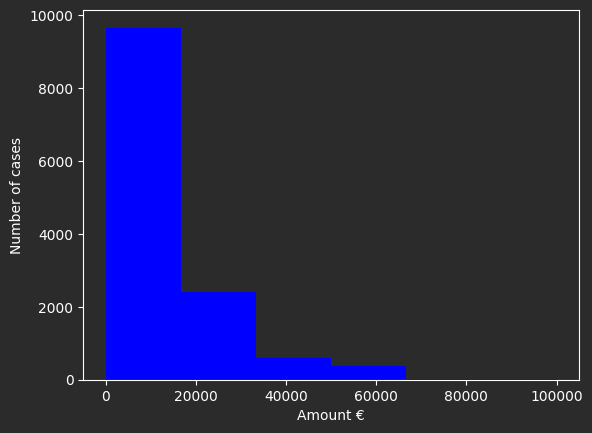
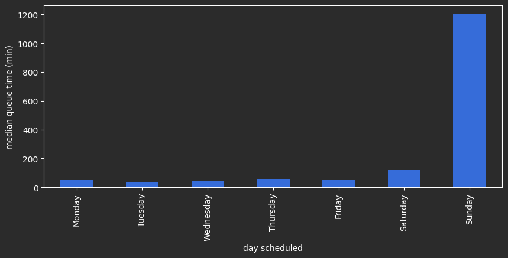
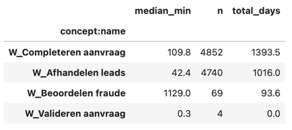
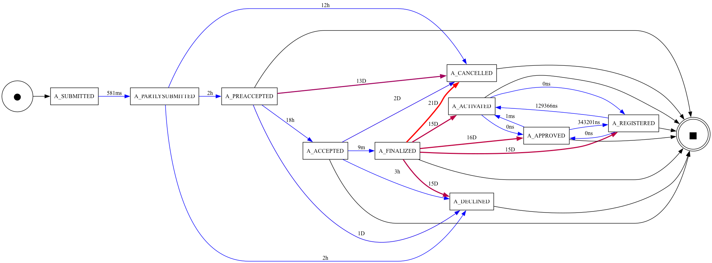
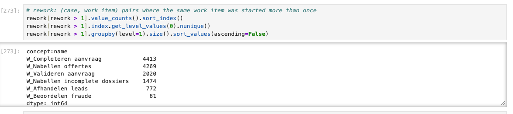

# Lean Application Process Mining

A process mining analysis of real world loan application process, using PM4Py (https://pm4py.fit.fraunhofer.de/) 
and the BPI challenge 2012 event log.

The goal is to understand how the process actually runs, where cases wait, where work is repeated, 
and where applications stall rather than how it is assumed to run.

## Data

The analysis uses the BPI Challenge 2012 event log, a real loan and overdraft application process from a Dutch financial institution.

262200 events across 13087 cases.

The dataset merges three intertwined subprocesses, identifiable by the prefix of each activity name:
1. States starting with ‘A_’ --> States of the application 
2. States starting with ‘O_’ --> States of the offer belonging to the application 
3. States starting with ‘W_’ --> States of the work item belonging to the application (human tasks)
4. COMPLETE, SCHEDULE, START and COMPLETE --> tasks

## Repository structure
```
├── data/
│ ├── raw/ # the event log (not tracked — see download.md)
│ └── download.md
├── notebooks/
│ ├── 01_data_exploration.ipynb
│ └── 02_process_discovery.ipynb
├── reports/
│ └── figures/
├── requirements.txt
└── README.md
```

## Setup
```
pip install -r requirements.txt
```
Then download the log into /data/raw/ as described in /data/download.md and run the notebook in order.

## The process

Discovered from the application-state ("A_") events using the inductive miner. Submitted applications are pre-accepted, 
accepted, finalized and either approved (then registered and activated) or declined/cancelled.

## Findings

### Outcome

On the 13087 cases: 58.3% declined (7635), 21.4% canceled (2807), 17.2% approved (2246) and 3.1% with no outcomes (399).
The cases without an outcome were still in progress when the log was extracted (right-truncated) and are excluded 
from duration statistics.

The single most common path is A_SUBMITTED -> A_PARTLYSUBMITTED -> A_DECLINED, covering 26% of all cases, 
which is an instant automatic rejection. This is reflected in the median durations:

```
| Outcome   | Median duration | Mean duration |
|-----------|-----------------|---------------|
| Approved  | 14.4 days       | 16.7 days     |
| Cancelled | 16.8 days       | 18.5 days     |
| Declined  | ~11 minutes     | 2.0 days      |
```
source ("reports/figures/duration_stats.png") from 01_data_exploration.

Most declines are automatic, the mean is pulled up by a small slow tail.

### Requested amounts

Median requested amount is 10.000€ (mean is 13,573€). Amounts follow the expected round number pattern.
The highest is 99,999€ (two cases, both unsuccessful), the lowest amount is 0€ (one canceled junk submission).



### Queue time dominates the process

Splitting each work item into its queue phase (SCHEDULE -> START) and its work phase (START -> COMPLETE) 
shows where time actually goes:

Total work time: around 512 days
Total queue time: around 2503 days -> a 4.9x ratio

Roughly 83% of all elapsed time is spent waiting in queues (not doing actual work). 
The waiting is driven by items arriving outside of working hours sit until the next working period.
The median queue time is 25-50 minutes during the day but rises to 12+ hours for items scheduled late in the evening.



### Bottlenecks ranked by total impact

Ranking activities by total delay contributed (median queue time x number of cases) separates real bottlenecks from rare ones:



Fraud assessment has a very high median wait but affects few cases, so its overall impact is small.
The real bottlenecks are the two high volume tasks at the top.

The performance view of the application subprocess shows where time accumulates between steps:



### Rework

Work items are frequently started more than once within the same case:


Notably, rework (ping pong) is not a sign of a slow case. 
Canceled cases with back and forth close faster (median 14 days) than those without (31 days), 
and every approved case contains it. Rework marks cases that are actively worked, 
slow cases are the neglected ones.

### Stalled applications

Around 283 canceled cases show no back and forth and a median duration of aroung 31 days.
Most of these cases stall at W_Completeren aanvraag, the application is started, information is requested, 
and the customer goes silent
for a median of 18 days before the case is finally canceled.

## Data quality notes

1. Missing resources: 18,010 events (6.9%) have no `org:resource`. 
All  are `W_` events missing resource is structural (unassigned work items), not random.

2. Tied timestamps: 25,369 events (9.7%) share a timestamp with another event in the same case, 
across 11,374 groups. Within these, event order comes from log order, not the timestamps.

3. Truncation:** the 399 outcome-less cases are cut off at the log's extraction date.

## Tools

Python, PM4Py, pandas and matplotlib. 

